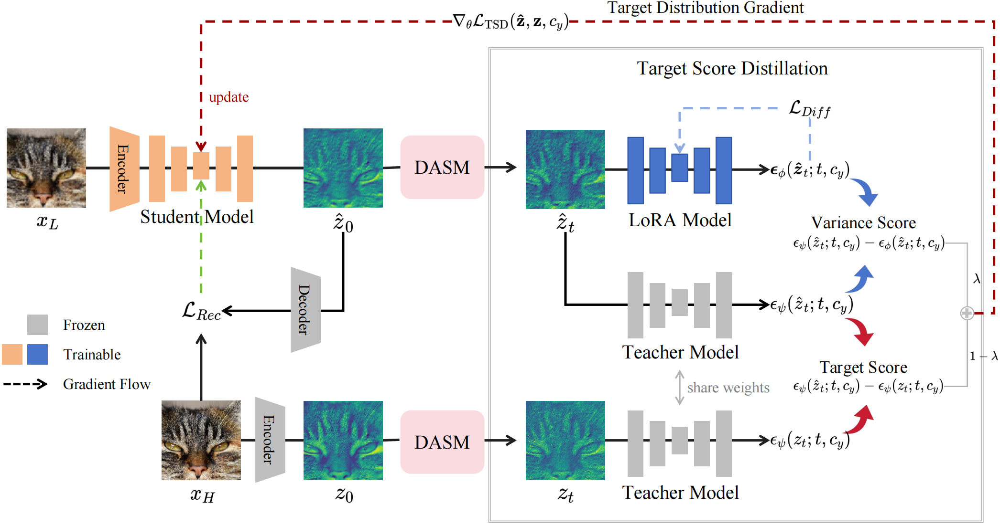
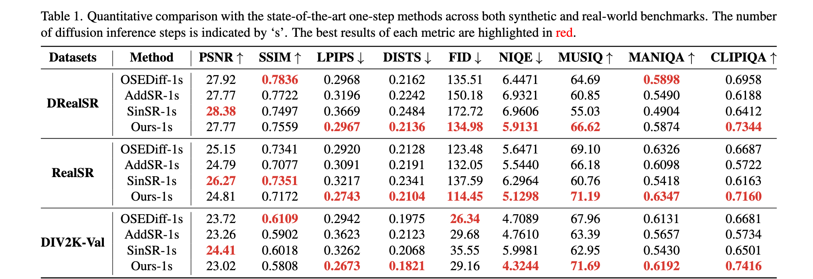
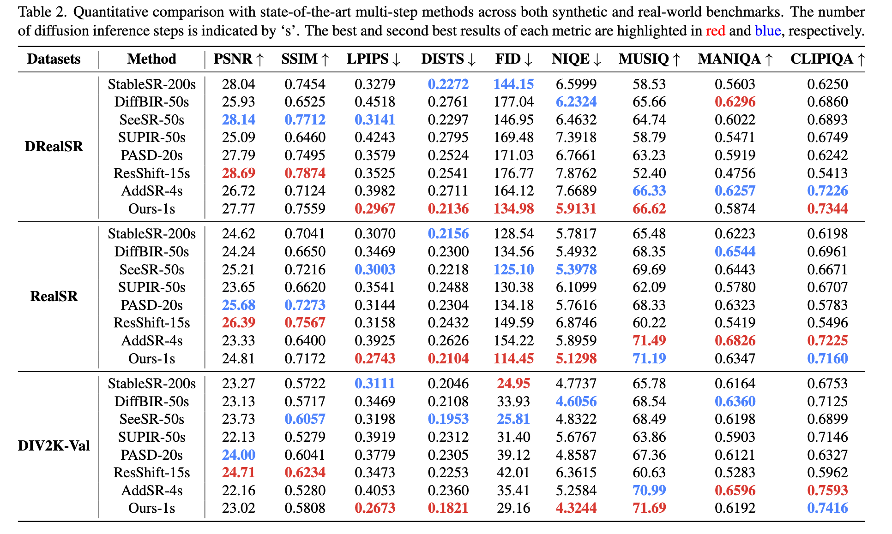
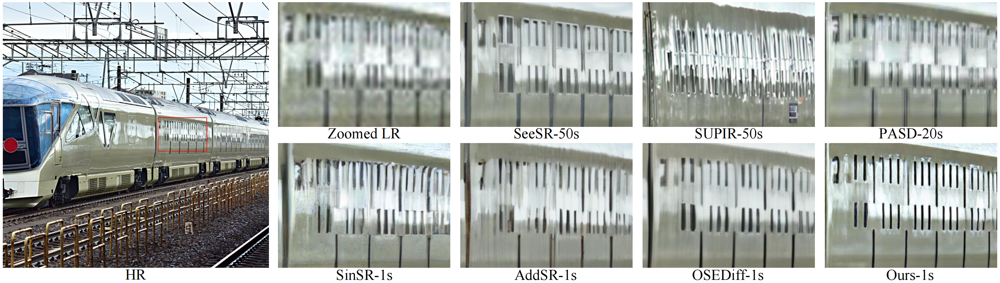
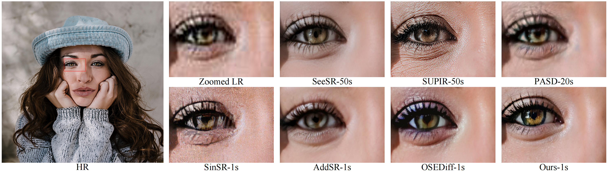
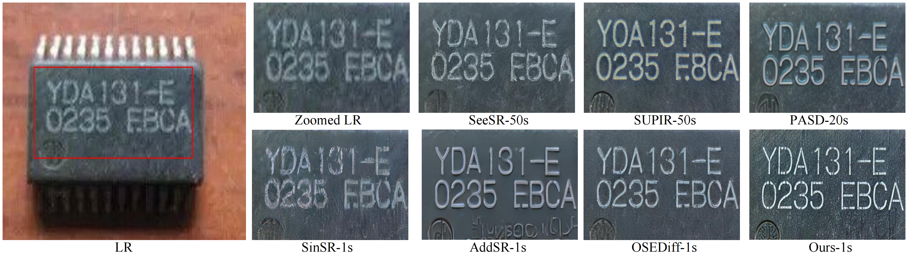
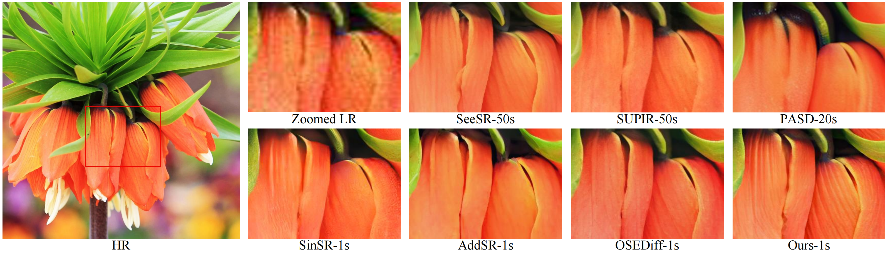
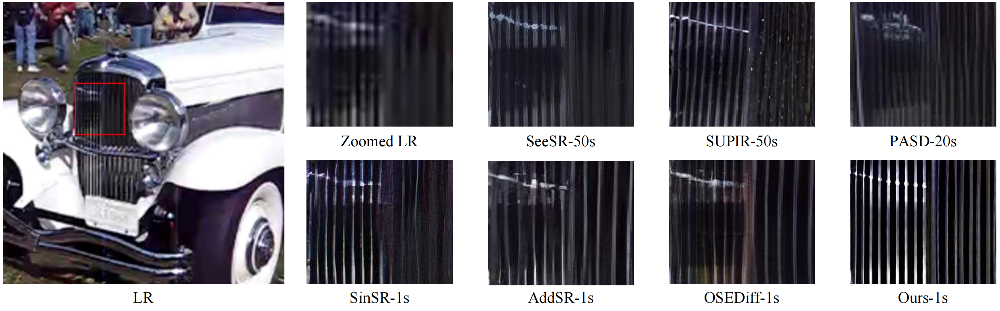
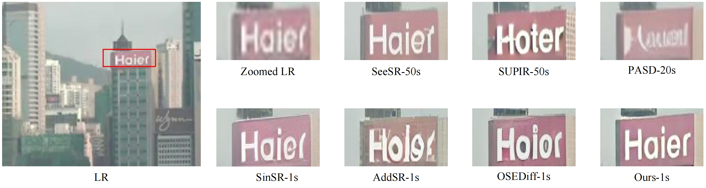
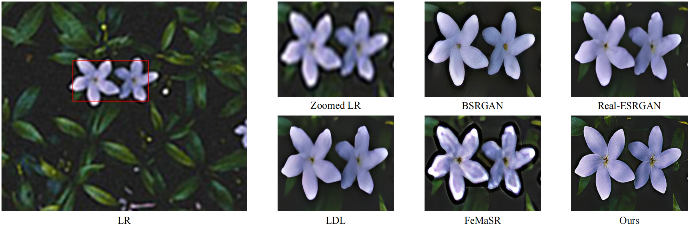

<div align="center">


<h1>TSD-SR: One-Step Diffusion with Target Score Distillation for Real-World Image Super-Resolution [PyTorch]</h1>

<div>
    <a href='https://github.com/Microtreei' target='_blank'>Linwei Dong<sup>1,2*</sup></a>&emsp;
    <a href='https://fqnchina.github.io/' target='_blank'>Qingnan Fan<sup>2,*</sup></a>&emsp;
    <a href='https://github.com/Sun-Made-By-Yi' target='_blank'>Yihong Guo<sup>1</sup></a>&emsp;
    <a href='https://github.com/Wzh10032' target='_blank'>Zhonghao Wang<sup>3</sup></a>&emsp;
    <a href='https://qzhang-cv.github.io/' target='_blank'>Qi Zhang<sup>2</sup></a>&emsp;
    <a href='https://scholar.google.com/citations?hl=zh-CN&user=Pcsml4oAAAAJ' target='_blank'>Jinwei Chen<sup>2</sup></a>&emsp;
    <a href='https://scholar.google.com/citations?user=pnVwaGsAAAAJ&hl=en' target='_blank'>Yawei Luo<sup>1,†</sup></a>&emsp;
    <a href='https://scholar.google.com/citations?user=kj5HiGgAAAAJ&hl=en' target='_blank'>Changqing Zou<sup>1,4 </sup></a>
</div>
<div>
    <sup>1</sup>Zhejiang University, <sup>2</sup>Vivo Mobile Communication Co. Ltd, <sup>3</sup>University of Chinese Academy of Sciences,  <sup>4</sup>Zhejiang Lab 
</div>

&nbsp;&nbsp;<br>
<a href='https://arxiv.org/abs/2411.18263'></a> &nbsp;&nbsp;

#### 🚩Accepted by CVPR2025

---

</div> 


## 🔥 <a name="news"></a>News
- **[2025.03]** Training code is released.
- **[2025.01]** Release the TSD-SR, including the inference codes and pretrained models.
- **[2024.12]** This repo is created.

:hugs: If TSD-SR is helpful to your projects, please help star this repo. Thanks! :hugs:

## 🎬 <a name="overview"></a>Overview




## ⚙️ Dependencies and Installation
```
# git clone this repository
git clone https://github.com/Microtreei/TSD-SR.git
cd TSD-SR

# create an environment 
conda create -n tsdsr python=3.9
conda activate tsdsr
pip install -r requirements.txt
```

## 🚀 <a name="start"></a>Quick Start
#### Step 1: Download the pretrained models
- Download the pretrained SD3 models from [HuggingFace](https://huggingface.co/stabilityai/stable-diffusion-3-medium-diffusers/tree/main).
- Download the TSD-SR lora weights and prompt embeddings from [GoogleDrive](https://drive.google.com/drive/folders/1XJY9Qxhz0mqjTtgDXr07oFy9eJr8jphI?usp=drive_link) or [OneDrive](https://1drv.ms/f/c/d75249b59f444489/EsQQ2LLXp7pHsYMBVubgcsYBvEQXMmcNXGnz695odCGByQ?e=cRTmOX).

You can put the models weights into `checkpoint/tsdsr`.
You can put the prompt embbedings into `dataset/default`.

#### Step 2: Prepare testing data
You can put the testing images in the `imgs/test`.

#### Step 3: Run testing command
```
python test/test_tsdsr.py \
--pretrained_model_name_or_path /path/to/your/sd3 \
-i imgs/test \
-o outputs/test \
--lora_dir checkpoint/tsdsr \
--embedding_dir dataset/default
```

## 🌈 <a name="start"></a>Evaluation
#### Step 1: Download the StableSR test datasets
- **Download StableSR testsets** (DrealSRVal_crop128, RealSRVal_crop128, DIV2K_V2_val) from [GoogleDrive](https://drive.google.com/drive/folders/1XJY9Qxhz0mqjTtgDXr07oFy9eJr8jphI?usp=drive_link) or [OneDrive](https://1drv.ms/f/c/d75249b59f444489/EsQQ2LLXp7pHsYMBVubgcsYBvEQXMmcNXGnz695odCGByQ?e=cRTmOX). We sincerely thank the authors of StableSR for their well-curated test dataset.
- **Unzip** them into `imgs/StableSR_testsets/`, the data folder should be like this:
```
├── imgs
    ├── StableSR_testsets
        ├── DIV2K_V2_val
        │   ├── test_LR
        │   ├── test_HR
        ├── DrealSRVal_crop128
        │   ├── test_LR
        │   ├── test_HR
        ├── RealSRVal_crop128
            ├── test_LR
            ├── test_HR
```
#### Step 2: Download the pretrained models
- Download the TSD-SR lora weights `checkpoint/tsdsr-mse` from [GoogleDrive](https://drive.google.com/drive/folders/1XJY9Qxhz0mqjTtgDXr07oFy9eJr8jphI?usp=drive_link) or [OneDrive](https://1drv.ms/f/c/d75249b59f444489/EsQQ2LLXp7pHsYMBVubgcsYBvEQXMmcNXGnz695odCGByQ?e=cRTmOX). We employ this model for evaluation and set the `--align_method` to `adain`.

#### Step 3: Run testing command
Use **DRealSRVal_crop128** as an example.
```
python test/test_tsdsr.py \
--pretrained_model_name_or_path /path/to/your/sd3 \
-i imgs/StableSR_testsets/DrealSRVal_crop128/test_LR \
-o outputs/DrealSR \
--lora_dir checkpoint/tsdsr-mse \
--embedding_dir dataset/default \
--align_method adain
```
#### Step 4: Run testing metrics command
```
python test/test_metrics.py \
--inp_imgs outputs/DrealSR \
--gt_imgs imgs/StableSR_testsets/DrealSRVal_crop128/test_HR \
--log logs/metrics
```

## 🔥 <a name="start"></a>Train
#### Step 1: Download the training data
- Download the [LSDIR](https://huggingface.co/ofsoundof/LSDIR), [FLICKR2K](https://www.kaggle.com/datasets/daehoyang/flickr2k), [DIV2K](https://data.vision.ee.ethz.ch/cvl/DIV2K/), [FFHQ](https://huggingface.co/datasets/student/FFHQ) dataset and store it in your preferred location.

#### Step 2: Prepare the degraded images and prompt texts
- **Generate degraded images**: We employ the same degradation pipeline as [SeeSR](https://github.com/cswry/SeeSR/tree/main). More details can be found at [here](https://github.com/cswry/SeeSR/blob/main/README.md#-train). Thanks for this awesome work. In addition, you can put the prompt texts in `your_training_datasets/lr_bicubic`.
- **Prompt texts**: You may use either tag-based prompts (generated via [DAPE](https://github.com/cswry/SeeSR/blob/main/README.md#-quick-inference), download from [here](https://drive.google.com/drive/folders/12HXrRGEXUAnmHRaf0bIn-S8XSK4Ku0JO)) or natural language descriptions (produced by the Large Language and Vision Assistant, [LLaVA](https://github.com/haotian-liu/LLaVA)) as high-quality (HQ) image prompts. Thanks for these awesome works. In addition, you can put the prompt texts in `your_training_datasets/prompt_txt`.

#### Step 3: Prepare the training data
- **Modify** the dataset path in `data/data.py` and `data/process.py`, and ensure the directory structure:
```
your_training_datasets/ # Example: FLICKR2K/
    └── gt
        └── 0000001.png # GT images, (3, 512, 512)
        └── ...
    └── lr_bicubic
        └── 0000001.png # Bicubic LR images, (3, 512, 512)
        └── ...
    └── prompt_txt
        └── 0000001.txt # prompts for teacher model and lora model
        └── ...
```
- **Modify** the SD3 path in `data/process.py` and run it to generate the training data: 
```
python data/process.py 
```
This step is designed to **reduce GPU memory overhead during training**. Since SD3’s tokenizer and text encoder require significant parameter storage, we pre-compute their outputs and load them directly during training. Similarly, we also pre-process the HR (High-Resolution) latent space tensors to optimize memory efficiency. The final data folder will be like this:
```
your_training_datasets/ # Example: FLICKR2K/
    └── gt
        └── 0000001.png # GT images, (3, 512, 512)
        └── ...
    └── lr_bicubic
        └── 0000001.png # Bicubic LR images, (3, 512, 512)
        └── ...
    └── prompt_txt
        └── 0000001.txt # prompts for teacher model and lora model
        └── ...
    └── prompt_embeds
        └── 0000001.pt # SD3 prompt embedding tensors, (333, 4096)
        └── ...
    └── pool_embeds
        └── 0000001.pt # SD3 pooled embedding tensors, (2048,)
        └── ...
    └── latent_hr
        └── 0000001.pt # SD3 latent space tensors, (16, 64, 64)
        └── ...
```
#### Step 4: Download the teacher lora and null prompts embeddings
- Download the [teacher models](https://drive.google.com/file/d/1do8pfdm_oNUhJKxTlC_x7LqY7NlE0-Q7/view?usp=sharing) and put them in `checkpoint/teacher/`. 
- Download the [null prompts embeddings](https://drive.google.com/drive/folders/1_kSod1CCq_xwdwDnLYUhr7iaT70eFPBD?usp=sharing) and put them in `dataset/null/`.

We derive the teacher LoRA weights through fine-tuning of the pretrained SD3 model with HR data, optimizing via Diffusion loss. This is designed to enhance the teacher model's sensitivity to HQ data. Use `use_teacher_lora` to enable LoRA weights; otherwise, the T2I SD3 model will be used as the teacher model by default.
The null prompts embeddings are used to compute cfg when training. 

#### Step 5: Run training command (or modify and execute `script/train.sh`):
```
export MODEL_NAME="/path/to/your/sd3_model";
export TEACHER_MODEL_NAME="checkpoint/teacher/";
export CHECKPOINT_PATH="checkpoint/tsdsr";
export HF_ENDPOINT="https://hf-mirror.com";
export OUTPUT_DIR="checkpoint/tsdsr-save/";
export OUTPUT_LOG="logs/tsdsr.log";
export LOG_NAME="tsdsr-train";
nohup accelerate launch  --config_file config/config.yaml  --gpu_ids 0,1,2,3,4,5,6,7 --num_processes 8 --main_process_port 57079 --mixed_precision="fp16" train/train.py \
  --pretrained_model_name_or_path=$MODEL_NAME  \
  --teacher_lora_path=$TEACHER_MODEL_NAME \
  --train_batch_size=2 --rank=64 --rank_vae=64 --rank_lora=64  \
  --num_train_epochs=200 --checkpointing_steps=5000 --validation_steps=500  --max_train_steps=200000 \
  --learning_rate=5e-06  --learning_rate_reg=1e-06 --lr_scheduler="cosine_with_restarts" --lr_warmup_steps=3000 \
  --seed=43 --use_default_prompt --use_teacher_lora --use_random_bias \
  --output_dir=$OUTPUT_DIR \
  --report_to="wandb" --log_code --log_name=$LOG_NAME \
  --gradient_accumulation_steps=1 \
  --resume_from_checkpoint="latest" \
  --guidance_scale=7.5  > $OUTPUT_LOG 2>&1 & \
```

## <a name="results"></a>🔎 Results
<details>
    <summary> Quantitative comparison with the state-of-the-art <b>one-step</b> methods across both synthetic and real-world benchmarks (click to expand). </summary>
    <p align="center">
    
    </p>
</details>

<details>
    <summary> Quantitative comparison with the state-of-the-art <b>multi-step</b> methods across both synthetic and real-world benchmarks (click to expand). </summary>
    <p align="center">
    
    </p>
</details>

<details>
    <summary> Visual comparisons of different <b>Diffusion-based</b> Real-ISR methods. </summary>
    <p align="center">
    
    </p>
    <p align="center">
    
    </p>
    <p align="center">
    
    </p>
    <p align="center">
    
    </p>
    <p align="center">
    
    </p>
    <p align="center">
    
    </p>
</details>

<details>
    <summary> Visual comparisons of different <b>GAN-based</b> Real-ISR methods. </summary>
    <p align="center">
    
    </p>
    <p align="center">
    
    </p>
</details>


## 🎫 <a name="license"></a>License
This project is released under the [Apache 2.0 license](LICENSE).

## <a name="citation"></a>🎓 Citation


```
@article{dong2024tsd,
  title={TSD-SR: One-Step Diffusion with Target Score Distillation for Real-World Image Super-Resolution},
  author={Dong, Linwei and Fan, Qingnan and Guo, Yihong and Wang, Zhonghao and Zhang, Qi and Chen, Jinwei and Luo, Yawei and Zou, Changqing},
  journal={arXiv preprint arXiv:2411.18263},
  year={2024}
}
```
